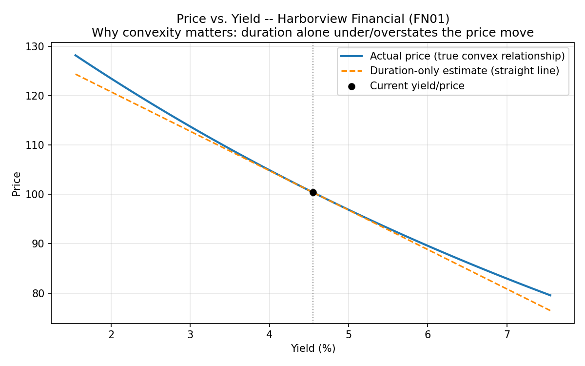

# Bond Pricing & Credit Spread Analyzer
 
A from-scratch Python engine for bond pricing, interest-rate risk (duration,
convexity), and credit spread analysis (G-spread, Z-spread) — applied to a
14-bond corporate universe across 4 sectors and 3 rating tiers (A/BBB/BB) to
rank names by relative value.
 
No QuantLib or black-box finance libraries — every calculation is built from
first principles: discounted cash flows, a bisection YTM solver, numerical
duration/convexity, and curve-based spread bootstrapping.
 
## Features
 
- **Bond pricing** — present-value pricing from a cash-flow schedule (semi-annual coupons)
- **YTM solver** — bisection search to back out yield-to-maturity from market price
- **Duration & convexity** — Macaulay duration, modified duration, and numerically-computed convexity
- **G-spread & Z-spread** — credit spread vs. Treasuries, with Z-spread bootstrapped against an interpolated par curve
- **Relative-value ranking** — groups bonds by sector/rating and flags the cheapest/richest name in each peer group by Z-spread
- **Visualization** — price-vs-yield chart showing the gap between a linear (duration-only) price estimate and the true convex price
## Results
 
Running the analyzer on the sample 14-bond universe produces:
 
| Metric | Range |
|---|---|
| YTM | 4.48% – 9.50% |
| Modified duration | 4.05 – 7.95 years |
| Convexity | 20.1 – 75.8 |
| G-spread | 15.0 – 520.2 bps |
| Z-spread | 20.9 – 540.8 bps |
 
The cheapest and richest bond in each of the 7 sector/rating peer groups is
flagged automatically. Z-spread runs consistently ~5–15 bps wider than
G-spread at longer maturities, illustrating why curve-based spread
measurement is more precise than single-point benchmarking.
 

 
## Installation
 
```bash
pip install -r requirements.txt
```
 
## Usage
 
```bash
python analyze.py
```
 
Outputs:
- Console table of YTM, modified duration, convexity, G-spread, Z-spread, and relative-value flag for every bond
- `results/bond_analysis.csv` — full metrics for every bond
- `results/price_yield_curve.png` — convexity illustration for the longest-duration bond
## Project structure
 
| File | Description |
|---|---|
| `bond_pricing.py` | Core math library — pricing, YTM solver, duration, convexity, G-spread, Z-spread |
| `analyze.py` | Loads data, computes metrics for every bond, ranks relative value, produces CSV + chart |
| `sample_bonds.csv` | 14 synthetic corporate bonds across 4 sectors and 3 rating buckets |
| `treasury_curve.csv` | Synthetic benchmark government yield curve (0.5Y–30Y) used for spread calculations |
 
## Methodology notes
 
- **YTM** is solved numerically via bisection since there's no closed-form solution (it's a polynomial root).
- **Convexity** is computed numerically (bumping yield ±1bp) rather than via closed-form formula, so the approach generalizes to any cash-flow pattern.
- **Z-spread** discounts each cash flow at its own point on the Treasury curve, then solves for the single flat spread that reconciles total PV to market price — more precise than G-spread, which only compares at one maturity point.
- **OAS** (option-adjusted spread) equals Z-spread for plain bullet bonds. This project doesn't model callable bonds, since OAS requires an interest-rate model (binomial tree / Monte Carlo) to strip out embedded option value.
- All data in `sample_bonds.csv` and `treasury_curve.csv` is synthetic — built to illustrate the mechanics, not to represent real market prices or issuers.
---
